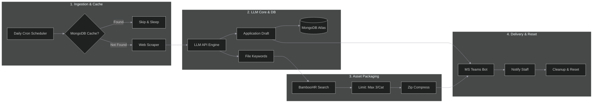

# Autonomous Agentic Grant Search & Application Engine

An automated AI workforce that eliminates manual regulatory discovery and document formulation. Built utilizing custom asynchronous orchestration loops, the agent autonomously crawls external web endpoints, parses complex compliance rules, and generates contextual long-form grant drafts.

## System Architecture

## Key Achievements & Metrics
*   **90% Processing Efficiency:** Reduced manual regulatory submission preparation workflows by 90% by executing multi-tier legal parsing algorithms automatically.
*   **Multi-Domain Flexibility:** Designed the system logic engine to seamlessly output custom documents tailored automatically across 3 unique federal and corporate grant type templates.

## Technical Implementation & Decisions
*   **Custom Agent Orchestration:** Opted to write standard native Python loops instead of bringing in high-level frameworks (e.g., CrewAI or LangGraph). This decision reduced runtime execution overhead, completely avoided rigid structure constraints, and allowed micro-optimized handling of target string data streams.
*   **Human-In-The-Loop Design:** Engineered the system to act purely as an autonomous compiler that hands off high-fidelity application drafts directly to team stakeholders, removing algorithmic risk prior to official submission.
