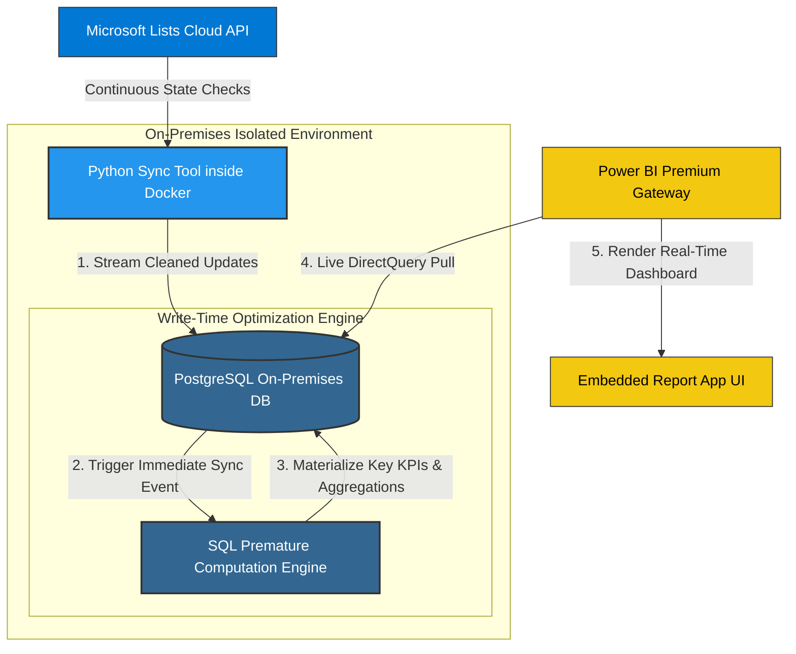

# On-Premises Data Sync & Real-Time BI Pipeline

A containerized synchronization engine that bridges Microsoft 365 cloud data stores with an isolated on-premises relational database. The system utilizes advanced write-time query pre-calculation to enable real-time operational dashboarding via Power BI DirectQuery with zero interface latency.

## System Architecture

## Key Achievements & Metrics
*   **Zero-Lag Live Reporting:** Scaled database response times to feed live reporting streams for over 1,000+ active enterprise clients simultaneously.
*   **Instantaneous Loading:** Eliminated runtime rendering bottlenecks by embedding a live Power BI DirectQuery dashboard tracking 8-10 core operational KPIs simultaneously.

## Technical Implementation & Decisions
*   **Write-Time Premature Calculations:** Rather than letting Power BI execute expensive data aggregations on the fly (which causes severe interface slowdowns), all calculations are performed via optimized native SQL scripts inside PostgreSQL the exact moment the Docker container pushes an update. 
*   **Continuous Synchronization Container:** Implemented a lightweight, isolated Python daemon running within Docker to constantly ping and pull mutations from Microsoft Lists, ensuring the on-premises engine stays up-to-the-minute accurate.
