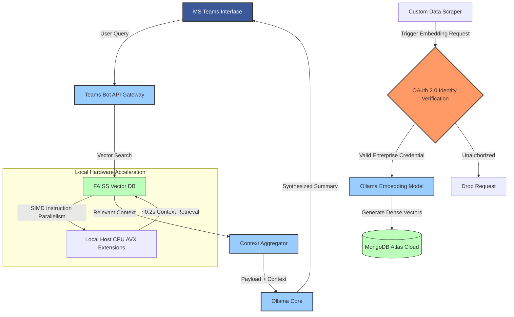

# Teams RAG Bot & Secure Embedding Pipeline

A production-grade Retrieval-Augmented Generation (RAG) system integrated directly into Microsoft Teams. The architecture splits into two primary pipelines: a low-latency, hardware-accelerated user query interface and a secure, OAuth 2.0-protected web scraping and embedding processor.

## System Architecture

## Key Achievements & Metrics
*   **Ultra-Low Latency:** Achieved query response times of `~0.2s` across 5.5k corporate documents by utilizing CPU-level SIMD (Single Instruction, Multiple Data) parallelism via FAISS vector indexing.
*   **Enterprise Security:** Implemented an absolute OAuth 2.0 boundary on the ingestion loop, ensuring only authenticated internal scraper agents can register embedded data into MongoDB Atlas.

## Technical Implementation & Decisions
*   **Vector Engine Choice:** Selected FAISS for vector similarity matching due to its highly efficient C++ backend capable of squeezing out maximum operations per clock cycle on localized computing hardware.
*   **Transition Roadmap:** Currently structurally isolated on on-premises host CPU instruction sets; mapped to seamlessly scale into a containerized cloud infrastructure environment without core logical refactoring.
